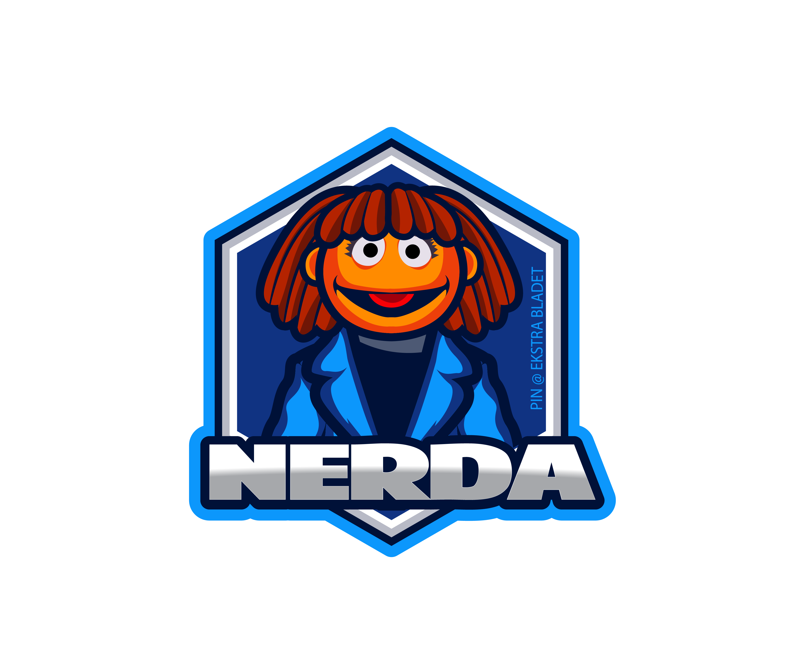

# NERDA 
Training and deployment of models for Named Entity Recognition in Danish (NERDA) based on Transformers.


## Installation guide
```
pip install NERDA
```

## Named Entity Recognition (NER) 
Identifying and extracting names of Named Entitites from natural language texts. 
