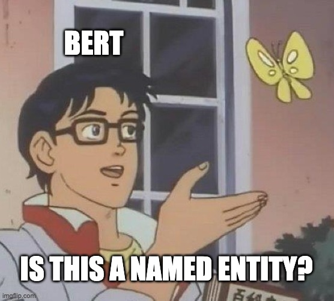

# ebNER 
Code for fine-tuning BERT models for Named Entity Recognition for Danish using the DaNE dataset, developed by and available at: https://github.com/alexandrainst/danlp

## Named Entity Recognition (NER) 
Identifying and extracting names of People, Locations and Orgainzations from natural language texts. 

## Running a fine-tuning
Current process: Clone this repo and run the "train.py" file.
Later versions will include more customizable training script.  

(Currently fine-tunes a multilingual BERT model)

